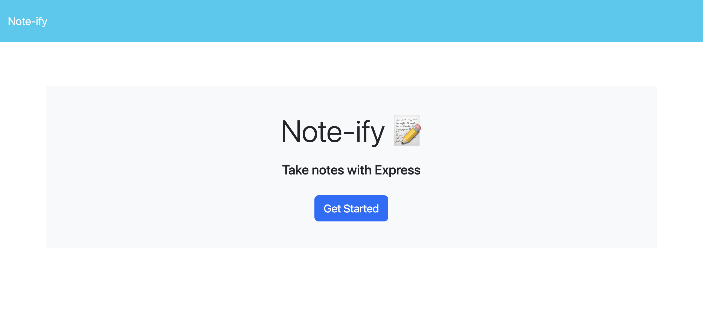
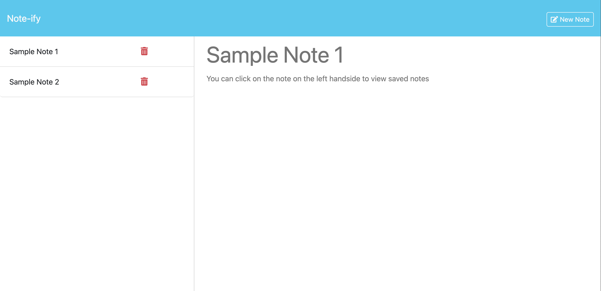

# Note-ify

## Description

Note-ify streamlines your reminders and notes in one place. You can add and delete notes whenever you like!

## Table of Contents

- db
    - db.json
- public
    - assets
    - index.html
    - notes.html
- package.json
- server.js
- readme.md

## Tasks 

- WHEN I enter click "GET STARTED" on the index page, THEN I am taken to the notes page
- WHEN I enter a title and text entry, THEN I am provided a SAVE NOTE button on the upper right handside of the page
- WHEN I click SAVE NOTE, THEN the note appears on the left handside by title
- WHEN I click any note on the left handside, THEN its contents render on the right handside of the page

## Usage
Here is a sample screenshot of our webpage!

## Links
- Deployed Webpage: https://github.com/scurvyirv/note-ify
- Render Webpage: https://note-ify.onrender.com

## Credits

- Express package: https://www.npmjs.com/package/express
- UUIDV4 Package: https://www.npmjs.com/package/uuidv4
- Insomnia: https://app.insomnia.rest/
- Starter Code provided by UCI

## License

MIT License

Copyright (c) 2024 scurvyirv

Permission is hereby granted, free of charge, to any person obtaining a copy of this software and associated documentation files (the "Software"), to deal in the Software without restriction, including without limitation the rights to use, copy, modify, merge, publish, distribute, sublicense, and/or sell copies of the Software, and to permit persons to whom the Software is furnished to do so, subject to the following conditions:

The above copyright notice and this permission notice shall be included in all copies or substantial portions of the Software.

THE SOFTWARE IS PROVIDED "AS IS", WITHOUT WARRANTY OF ANY KIND, EXPRESS OR IMPLIED, INCLUDING BUT NOT LIMITED TO THE WARRANTIES OF MERCHANTABILITY, FITNESS FOR A PARTICULAR PURPOSE AND NONINFRINGEMENT. IN NO EVENT SHALL THE AUTHORS OR COPYRIGHT HOLDERS BE LIABLE FOR ANY CLAIM, DAMAGES OR OTHER LIABILITY, WHETHER IN AN ACTION OF CONTRACT, TORT OR OTHERWISE, ARISING FROM, OUT OF OR IN CONNECTION WITH THE SOFTWARE OR THE USE OR OTHER DEALINGS IN THE SOFTWARE.
